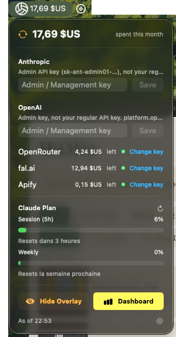
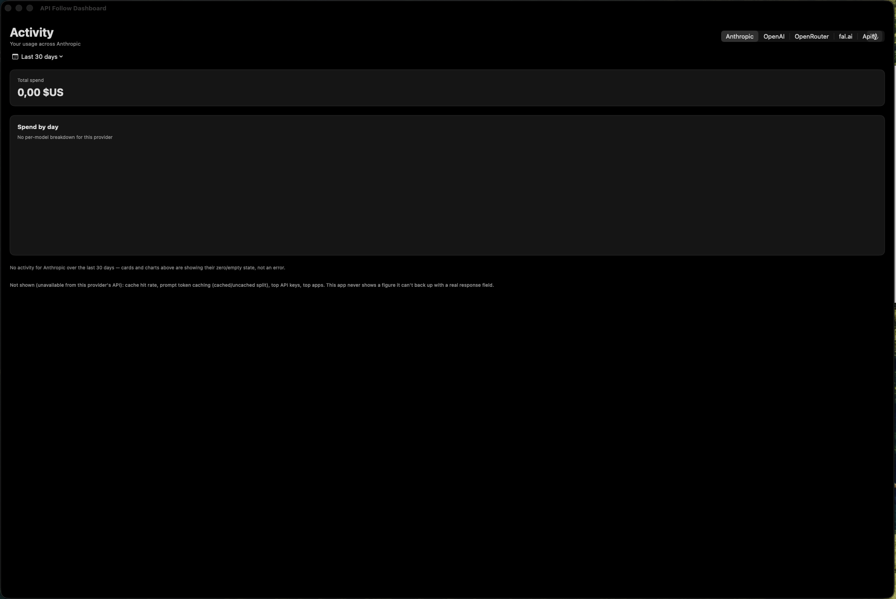
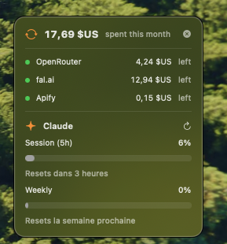

# APIFollow

A macOS menu bar app that tracks how much you're spending across your LLM/API
providers — at a glance, without opening five different dashboards.

## Screenshots

| Menu bar popover | Dashboard | Floating overlay |
|:---:|:---:|:---:|
|  |  |  |

## Features

- **Menu bar summary**: total spend this month, plus a per-provider row
  showing either remaining balance ("$X left") or month-to-date spend
  ("$X spent"), whichever the provider's API exposes.
- **Dashboard window**: per-day spend chart and history for any configured
  provider.
- **Floating overlay widget**: an always-on-top mini view for keeping an eye
  on spend while working.
- **Live polling**: providers with a prepaid/credit model (OpenRouter, fal.ai,
  Apify) poll every 30 seconds; others every 5 minutes.
- **Claude Code plan usage**: if Claude Code is installed and logged in,
  shows session (5h) and weekly rate-limit utilization.
- Keys are stored in the macOS Keychain, never on disk in plaintext.

### Supported providers

| Provider   | Spend history | Balance / envelope remaining |
|------------|:--------------:|:-----------------------------:|
| Anthropic  | ✅ | — (pay-as-you-go, no balance concept) |
| OpenAI     | ✅ | — (pay-as-you-go, no balance concept) |
| OpenRouter | ✅ | ✅ prepaid credits |
| fal.ai     | ✅ | ✅ prepaid credits |
| Apify      | ✅ | ✅ monthly plan cap remaining |

### Getting an API key for each provider

Every provider needs an **Admin/Management-scoped key** — your regular
day-to-day API key won't work here, since it can't read spend/usage data,
only make inference calls. Paste the key into the corresponding row in the
menu bar popover.

| Provider | Where to create it |
|----------|---------------------|
| Anthropic | Console → Settings → Organization → Admin API key (`sk-ant-admin01-…`) |
| OpenAI | [platform.openai.com/settings/organization/admin-keys](https://platform.openai.com/settings/organization/admin-keys) |
| OpenRouter | [openrouter.ai/settings/management-keys](https://openrouter.ai/settings/management-keys) — a Management (Provisioning) key |
| fal.ai | fal.ai → API Keys → create a new key with **ADMIN** scope |
| Apify | Apify Console → Settings → Integrations → personal API token |

### Why does it ask for my Mac password?

Keys are saved in the **macOS Keychain** (`KeychainStore.swift`), never
written to disk in plaintext or checked into the SQLite history store — the
password prompt you see is macOS's own Keychain Access dialog, not something
this app implements itself.

You'll typically see it twice: once the first time you save a key for a
provider, and then again **every time you rebuild the app** during
development. That second part is a side effect of `scripts/build-app.sh`
ad-hoc signing the bundle (`codesign --sign -`) — each rebuild can produce a
slightly different code identity, and the Keychain re-checks the calling
app's signature against the one that originally saved the item before
releasing it. It's expected for local/unsigned builds, not a bug; a
consistently signed release build wouldn't re-prompt like this.

## Requirements

- macOS 13+
- Swift 6 toolchain (Xcode 16+, or the standalone Swift toolchain)

## Building and running

```sh
swift build
swift test
```

`swift run` launches a bare executable — macOS's Dock/menu-bar/activation
machinery is unreliable for GUI apps run that way. Use the packaging script
instead, which builds a real `.app` bundle and launches it:

```sh
./scripts/build-app.sh
```

If the app is already running, `open` on the bundle just re-activates the
existing process instead of picking up a new build — quit it first
(`pkill APIFollow` or Cmd-Q) before re-running the script to pick up code
changes.

## Architecture

Each provider is a `ProviderAdapter` (spend history) and, optionally, a
`BalanceFetcher` (remaining balance/credits) — see
`Sources/APIFollow/Adapters/ProviderAdapter.swift`. Adding a new provider
means implementing one or both of these against its API and registering it
in `APIFollowApp.init()` (`Sources/APIFollow/App.swift`); no other code
needs to change. `Poller` (`Sources/APIFollow/Polling/Poller.swift`) owns an
independent polling loop per provider, so polling intervals can differ
per-provider.

## License

MIT — see [LICENSE](LICENSE).
